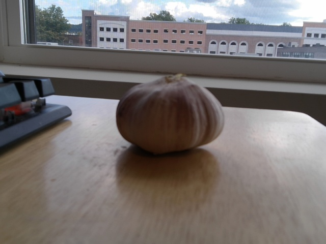
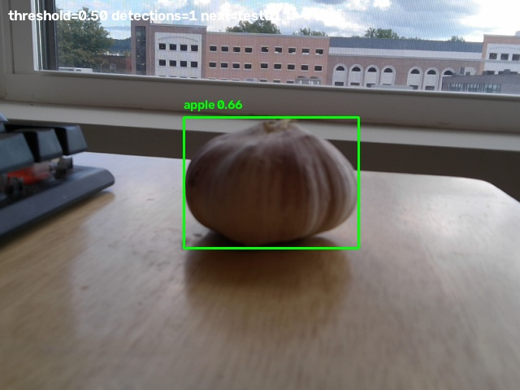
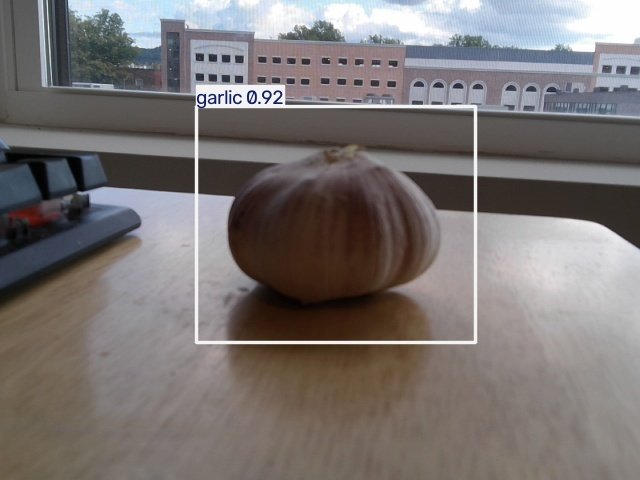

# CSE398/498 Lab 1: Object Detection with YOLO11 and YOLOE

**Author:** Xiaoxi Gao

**Course:** CSE398/498

**Report:** [Lab 1 report (PDF)](CSE498_Lab1_Report_Xiaoxi_Gao_20260906.pdf)

This repository contains three object-detection experiments: a pretrained YOLO11n webcam baseline, evaluation of a fine-tuned YOLO11n model, and YOLOE open-set detection using initial and refined text prompts. It includes source code, two YOLO11 checkpoints, 15 captured test images, annotated baseline and fine-tuned images, detection CSVs, a YOLOE notebook, and the lab report.

## Contents

- [Repository structure](#repository-structure)
- [Test images and evaluation](#test-images-and-evaluation)
- [Recorded results](#recorded-results)
- [Setup](#setup)
- [Run the experiments](#run-the-experiments)
- [CSV format](#csv-format)
- [Reproducibility and limitations](#reproducibility-and-limitations)
- [Troubleshooting](#troubleshooting)
- [Credits and licensing](#credits-and-licensing)

## Repository structure

```text
.
|-- README.md
|-- main.py                         # Interactive webcam demonstration
|-- compare_baseline_finetuned.py   # Compare saved per-image evaluations
|-- CSE498_Lab1_Report_Xiaoxi_Gao_20260906.pdf
|-- raw.zip                         # test01.jpg through test15.jpg
|-- models/
|   |-- yolo11n.pt
|   `-- yolo11n_finetuned_final.pt
|-- experiment1_yolo11_baseline/
|   |-- capture_baseline.py
|   |-- true_result.py
|   `-- results/exp1_baseline/
|       |-- raw/                    # 15 unannotated test images
|       |-- annotated/              # 15 baseline visualizations
|       `-- detections.csv
|-- experiment2_finetuning/
|   |-- test_finetuned.py
|   |-- true_result_finetuned.py
|   `-- results/exp2_finetuned/
|       |-- annotated/              # 15 fine-tuned visualizations
|       |-- detections.csv
|       `-- detections_with_ground_truth.csv
`-- experiment3_yoloe_open_set/
    |-- zero_shot_object_detection_and_segmentation_with_yoloe.ipynb
    |-- initial_text_prompt/detections.csv
    `-- final_text_prompt/detections.csv
```

## Test images and evaluation

The saved experiments use the following 15 images and six ground-truth labels:

| Image IDs | Ground-truth label | Count |
|---|---|---:|
| test01-test02 | garlic | 2 |
| test03-test07 | apple | 5 |
| test08-test09 | key | 2 |
| test10 | game_controller | 1 |
| test11-test12 | glasses | 2 |
| test13-test15 | green_chili | 3 |

The YOLO11 evaluation scripts assign `correct` when a predicted class exactly matches the ground-truth label, `wrong` for a different class, and `miss` for `NO_DETECTION`. The comparison script normalizes image filenames and keeps one row per image, preferring a correct detection if several rows exist.

Consequently, the reported accuracy is **image-level class-match accuracy**, not mAP, precision, recall, or a bounding-box IoU metric. Additional incorrect detections are not penalized when an image also contains a correct prediction.

## Recorded results

Results below come from the committed CSV files. Run `python compare_baseline_finetuned.py` from the repository root to reproduce the YOLO11 summary without loading models or accessing a camera.

| Experiment | Confidence threshold | Correct images | Wrong images | Missed images | Class-match accuracy |
|---|---:|---:|---:|---:|---:|
| Pretrained YOLO11n | 0.50 | 3 | 10 | 2 | 20.0% |
| Fine-tuned YOLO11n | 0.50 | 15 | 0 | 0 | 100.0% |

The saved fine-tuned results improve this metric by **80.0 percentage points** on these 15 images. This small test set does not establish generalization to new scenes.

### YOLOE prompt refinement

The notebook uses `yoloe-v8l-seg.pt` with a confidence threshold of `0.10` for both prompt variants.

| Target | Initial prompt | Refined prompt |
|---|---|---|
| apple | red apple | dark red apple with a visible stem |
| game_controller | game controller | red video game controller with two joysticks |
| garlic | whole garlic bulb | round purple garlic bulb with striped skin |
| glasses | black eyeglasses | black round eyeglasses lying on a wooden table |
| green_chili | green chili pepper | small curved wrinkled green chili pepper on a wooden table |
| key | metal key | small brass house key lying on a wooden table |

The initial CSV has no detections for test09 and test13-test15. The refined CSV has no detections for test14-test15; it includes a key prediction for test09, a controller prediction for test10, and a chili prediction for test13. Some images also contain incorrect or duplicate predictions. YOLOE CSVs do not include ground-truth evaluations, and the comparison script does not score them. Its lower threshold and descriptive class labels also need to be considered before comparing it with YOLO11.

### Example: garlic (test01)

| Raw image | Baseline | Fine-tuned |
|---|---|---|
|  |  |  |

## Setup

The local scripts use Python, OpenCV, and Ultralytics. Python 3.10 can be used as a starting point; this repository does not contain a dependency lockfile or a recorded complete training environment.

```powershell
git clone https://github.com/Xiaoxi-Gao/cse398-498-lab1-yolo.git
cd cse398-498-lab1-yolo
python -m venv .venv
.\.venv\Scripts\Activate.ps1
python -m pip install --upgrade pip
python -m pip install ultralytics opencv-python
```

For macOS/Linux, activate with `source .venv/bin/activate`. Webcam scripts require a desktop session and camera access. The saved CSV comparison uses only the Python standard library.

## Run the experiments

Commands below assume you start at the repository root unless a `cd` step is shown. Script paths are resolved relative to the current working directory.

### 1. Webcam demonstration

```powershell
python main.py
```

This loads `models/yolo11n.pt`, uses camera index `1`, and applies confidence `0.50`. Press **s** to save the annotated frame as `capture_<frame_number>.jpg` in the current directory; press **q** to quit. If necessary, change `cv2.VideoCapture(1)` to use your camera's index, commonly `0`.

### 2. Baseline capture and evaluation

Before running the capture script from its experiment directory, change its `MODEL_PATH` from `./models/yolo11n.pt` to **`../models/yolo11n.pt`**. The existing model path assumes the repository root, while its output paths and evaluation script assume the experiment directory. This adjustment makes those paths consistent.

```powershell
cd experiment1_yolo11_baseline
python capture_baseline.py
# Press s to save a test image; press q to finish.
python true_result.py
cd ..
```

The capture script saves both raw and annotated images and appends detection rows. Existing files are retained and numbering continues after the largest saved test number. The evaluation script rewrites the CSV with ground-truth labels and evaluations. Its hard-coded ground truth covers only test01-test15; update the mapping before evaluating newly captured images. Back up saved results if you want to preserve the original experiment while collecting a new set.

### 3. Fine-tuned model evaluation

```powershell
cd experiment2_finetuning
python test_finetuned.py
python true_result_finetuned.py
cd ..
python compare_baseline_finetuned.py
```

The inference script loads `../models/yolo11n_finetuned_final.pt` and evaluates the baseline raw images at confidence `0.50`. It overwrites the fine-tuned detection CSV and annotated images. The ground-truth script creates `detections_with_ground_truth.csv`.

Expected summary for the committed results:

```text
Baseline:   3/15 correct | 10 wrong | 2 miss | Accuracy = 20.0%
Fine-tuned: 15/15 correct | 0 wrong | 0 miss | Accuracy = 100.0%
Improvement: +80.0 percentage points
```

This folder provides the trained checkpoint and evaluation code. It does not contain a training script, training dataset, dataset YAML, or full training logs, so end-to-end retraining cannot be reproduced solely from this repository.

### 4. YOLOE open-set experiment

Open [the YOLOE notebook](experiment3_yoloe_open_set/zero_shot_object_detection_and_segmentation_with_yoloe.ipynb) in Google Colab or a compatible GPU notebook environment.

1. Enable a CUDA GPU: the supplied inference cells explicitly call `.cuda()`.
2. Run the environment setup cells. They install YOLOE and its CLIP, MobileCLIP, and LVIS dependencies from the upstream repository, plus `supervision` and `jupyter_bbox_widget`.
3. Run the model download cells. The notebook downloads YOLOE weights separately; those checkpoints are not in `models/`.
4. Upload `raw.zip` and extract it into the notebook working directory so `test01.jpg` through `test15.jpg` are directly accessible. For Colab, run `!unzip -o /content/raw.zip -d /content` in a code cell.
5. Run the lab's initial text-prompt batch cell and the refined text-prompt batch cell, after their setup dependencies.
6. The cells write `experiment3_yoloe/` and `experiment3_yoloe_promptG/`, respectively, including annotated images and `detections.csv`. The saved CSVs in this repository are organized under `initial_text_prompt/` and `final_text_prompt/`.

The notebook also contains tutorial demonstrations for visual prompts, segmentation, and video processing. Some require interactive bounding-box selection or downloaded sample media; they are separate from the 15-image text-prompt experiment. Generated YOLOE annotated-image folders and standalone output videos are not included in this checkout.

## CSV format

Common fields are:

| Field | Meaning |
|---|---|
| `image_id` | Test identifier, with or without `.jpg` |
| `predicted_class` | Model class name or YOLOE text prompt; `NO_DETECTION` when empty |
| `confidence` | Prediction confidence |
| `x1`, `y1`, `x2`, `y2` | Bounding-box corners in image pixel coordinates |
| `conf_threshold` | Inference confidence cutoff |

The baseline CSV also contains `timestamp`, `ground_truth`, `evaluation`, and `notes`. The evaluated fine-tuned CSV adds `ground_truth` and `evaluation` to its original detection fields. There can be multiple rows per image; no-detection rows have empty confidence and coordinates.

## Reproducibility and limitations

- The committed CSVs and images preserve the recorded results; rerunning inference can vary with package versions and hardware.
- Only 15 test images are included, with unequal counts across six classes.
- Evaluation is based on class-name matching and does not validate localization with IoU.
- YOLO11 and YOLOE use different confidence thresholds and class vocabularies.
- Training data, data splits, and complete training settings are not included; dataset independence cannot be verified from these files alone.
- The notebook installs from upstream Git repositories without pinning commits. Its original environment may need dependency adjustments when rerun.
- Ground-truth mappings are fixed to the supplied test images. Keep image IDs and labels aligned when replacing data.

## Troubleshooting

- **Camera does not open:** check the camera index, Windows camera permissions, and whether another application is using it. The baseline capture script tries DirectShow first, then the default backend.
- **Model file not found:** run commands from the indicated directory and apply the baseline `MODEL_PATH` adjustment described above.
- **`true_result_finetuned.py` not found:** run it inside `experiment2_finetuning`, not `experiment1_yolo11_baseline`.
- **PowerShell activation is blocked:** use `.\.venv\Scripts\python.exe` directly instead of activating, for example `.\.venv\Scripts\python.exe compare_baseline_finetuned.py` from the repository root.
- **CUDA error in the notebook:** select a GPU runtime. CPU use requires replacing `.cuda()` calls and adapting the notebook environment.
- **New images receive `UNKNOWN`:** extend the ground-truth dictionaries before evaluation.

## Credits and licensing

The project uses Ultralytics YOLO11 and YOLOE. The notebook retains attribution to Roboflow Notebooks and the THU-MIG YOLOE project in its introductory cells. See the notebook and the lab report for the included source references and experiment discussion.

No standalone repository `LICENSE` file is included. Consult the applicable upstream licenses for dependencies, model weights, and reused notebook material; this README does not assign a new license to them.
